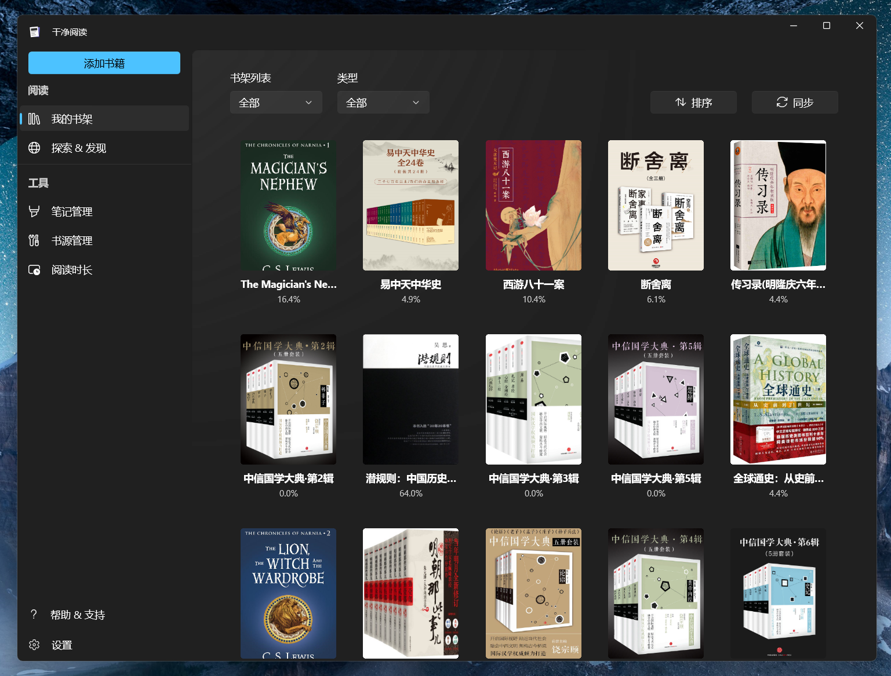

# 干净阅读

    

`干净阅读` 现在为 Windows 11 设计！
  

[English](README_EN.md)

---

`干净阅读` 是一款小说阅读应用，使用 Windows App SDK 开发，是原生的 Windows 应用，支持 Windows 11 系统。适合喜欢阅读网文，或者本地轻量阅读的用户。

> 新版的干净阅读为了尽可能完善地支持本地阅读，使用了最新的 Windows App SDK，默认以 `runFullTrust` 权限运行。该权限可以通过路径直接读取文件内容，而不必经过用户交互。 这是一个敏感的权限，所以应用选择开源以示坦诚。

> 由于开源，所以将关闭商店的试用版。想要试用应用，你可以按照 [侧加载](#侧加载-sideload) 进行操作。如果你喜欢这个应用，可以在商店购买以支持作者哟~

## 🙌 简单的开始

> **商店版本** 和 **侧加载版本** 可以共存

### 从商店安装

将链接 `ms-windows-store://pdp/?productid=9MV65L2XFCSK` 复制到浏览器地址栏打开，从 Microsoft Store 购买。购买后会永久保留在你的 Microsoft 账户下，可以通过 Store 进行下载加速与静默更新。

商店版本仅支持 Windows 11 及以上的系统，更新频率为每月一次（如果当月有更新的话），时间是月底。

### 侧加载 (Sideload)

如果你想本地安装干净阅读，或者尝试当月的最新功能。请打开右侧的 [Release](https://github.com/Clean-Reader/CleanReader.Desktop/releases) 页面，找到最新版本，并选择适用于当前系统的安装包下载。

然后打开 [系统设置](ms-settings:developers)，打开 `开发者模式` ，并等待系统安装一些必要的扩展项。

在应用压缩包下载完成后，解压压缩包，并在管理员模式下，使用 **Windows PowerShell** *(不是PowerShell Core)* 运行解压后的 `install.ps1` 脚本，根据提示进行安装。

**Watch** 项目，以获取应用的更新动态。

关于如何一步步地使用侧加载 (Sideload) 方式安装 UWP 应用及订阅应用更新，请参见 [侧加载包的安装](https://docs.richasy.cn/clean-reader/sideload) 。

## ❓ 常见问题

在应用的安装使用过程中，你可能会碰到一些问题，这篇文档也许可以帮助你解决遇到的困难：[常见问题](https://docs.richasy.cn/clean-reader/qa)

## 📃 文档

干净阅读的文档托管在 [docs.richasy.cn](https://docs.richasy.cn/clean-reader/desktop) 上，你可以点击链接以查看干净阅读的使用说明

## 🚀 协作

非常感谢有兴趣的开发者或爱好者参与 `干净阅读` 项目，分享你的见解与思路。如果你需要修改核心的阅读器功能，请在 [CleanReader.Core](https://github.com/Clean-Reader/CleanReader.Core) 中修改.

## 💬 讨论

借助 Github 平台提供的 Discussions 功能，对于一般讨论、提议或分享，我们都可以在 [干净阅读论坛](https://github.com/Clean-Reader/CleanReader.Desktop/discussions) 中进行，欢迎来这里进行讨论。

## 🌏 路线图

干净阅读会逐步完善，请查看 [干净阅读里程碑](https://github.com/Clean-Reader/CleanReader.Desktop/milestones) 来了解干净阅读下一步打算做的事情。于此同时，欢迎各位开发者加入，让我们一起打造干净阅读的未来。

## 🧩 截图

