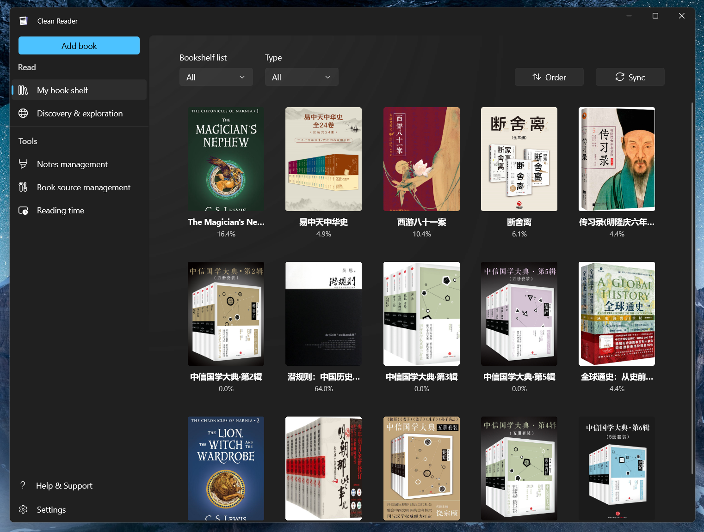

# Clean Reader

    

`Clean Reader` is now designed for Windows 11!
  

[简体中文](README.md)

---

`Clean Reader` is a novel reader app developed using the UWP framework. It is a native Windows application and supports Windows 10/11 systems. It is suitable for users who like to read web articles, or local light reading.

> In order to support local reading as fully as possible, the new version of clean reader uses the latest Windows App SDK and runs with `runFullTrust` permission by default. This permission can directly read the file content through the path without user interaction. This is a sensitive permission, so the app chooses to open source to be honest.

> Due to open source, the trial version of the store will be closed. To try out the app, you can follow [Sideload](#Sideload) to install it. If you like this app, you can buy it in the store to support the developer~

## 🙌 Quick start

> **Store Version** and **Sideload Version** can coexist.

### Install from the Microsoft Store

Copy the link `ms-windows-store://pdp/?productid=9MV65L2XFCSK` to the browser address bar to open it and buy it from the Microsoft Store. After purchase, it will remain permanently under your Microsoft account, and you can download accelerated and silent updates through the Store.

The store version only supports Windows 11 and above, and the update frequency is once a month (if there is an update in that month), and the time is the end of the month.

### Sideload

If you want to install clean read locally, or try the latest features of the month. Please open the [Release](https://github.com/Clean-Reader/CleanReader.Desktop/releases) page on the right, find the latest version, and select the installation package suitable for the current system to download.

Then open the system settings, turn on `Developer mode`, and wait for the system to install some necessary extensions.

After the application package is downloaded, unzip the package, and in administrator mode, use **Windows PowerShell** *(not PowerShell Core)* to run the unzipped `install.ps1` script, and follow the prompts to install.

**Watch** repo to get app updates.

For step-by-step instructions on how to install UWP apps and subscribe to app updates using sideloading, please refer to [侧加载包的安装](https://docs.richasy.cn/clean-reader/sideload) 。

## ❓ Q&A

During the installation and use of the application, you may encounter some problems. This document may help you solve the problems encountered: [常见问题](https://docs.richasy.cn/clean-reader/qa)

## 📃 Documentation

Documentation for clean reader is hosted at [docs.richasy.cn](https://docs.richasy.cn/clean-reader/desktop), You can click on the link to see the clean reader instructions for use

## 🚀 Cooperation

Thank you very much for interested developers or enthusiasts to participate in the `clean reader` project and share your insights and ideas. If you need to modify the core reader function, please modify it in [CleanReader.Core](https://github.com/Clean-Reader/CleanReader.Core).

## 💬 Discussions

With the Discussions feature provided by the Github platform, for general discussions, proposals or sharing, we can all have it in the [Clean Reader Forum](https://github.com/Clean-Reader/CleanReader.Desktop/discussions), welcome here have a discussion.

## 🌏 Roadmap

Clean reader will improve gradually, please check [Clean Reader Milestones](https://github.com/Clean-Reader/CleanReader.Desktop/milestones) to see what clean reader intends to do next. In the meantime, developers are welcome to join us, and let's build the future of clean reader together.

## 🧩 Screenshot

